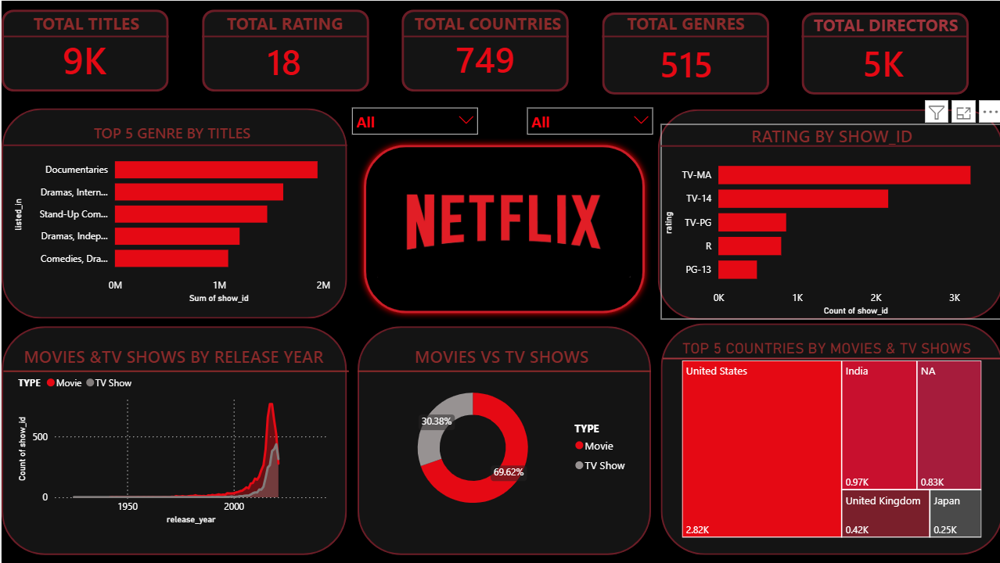

# Netflix Content Analytics Dashboard

## 📌 Project Overview
This project is an interactive Power BI dashboard built using the Netflix Movies and TV Shows dataset. The dashboard provides insights into Netflix's content library by analyzing titles, genres, ratings, countries, release years, and content types.

---

## Dashboard Preview



---

## Objectives
- Analyze Netflix content distribution.
- Compare Movies and TV Shows.
- Identify top genres and countries.
- Explore content ratings.
- Analyze release year trends.
- Build an interactive Power BI dashboard.

---

## Key Performance Indicators (KPIs)
- Total Titles
- Total Movies
- Total TV Shows
- Total Directors
- Total Countries
- Total Genres

---

## Visualizations
- KPI Cards
- Top Genres by Titles (Bar Chart)
- Ratings by Titles (Bar Chart)
- Movies vs TV Shows (Donut Chart)
- Release Year Trend (Area Chart)
- Top Countries (Treemap)
- Interactive Slicers (Type, Release Year)

---

## Data Cleaning
Data preparation was performed in Power Query:
- Removed duplicate records
- Handled null values
- Corrected data types
- Removed unnecessary columns
- Fixed inconsistent records
- Trimmed and cleaned text values

---

## Tools Used
- Microsoft Power BI
- Power Query
- DAX
- Microsoft Excel

---

## Dataset
Dataset: Netflix Movies and TV Shows

Source:
https://www.kaggle.com/datasets/sunilkumar/netflix-shows

---

## Key Insights
- Movies make up the majority of Netflix content.
- Drama and International Movies are among the most common genres.
- The United States contributes the highest number of titles.
- Most content was added after 2015.
- TV-MA is one of the most frequent content ratings.

---

## Repository Structure

```text
netflix-powerbi-dashboard/
│
├── Dashboard/
│   └── Netflix_Dashboard.pbix
│
├── Dataset/
│   └── netflix_titles.csv
│
├── dashboard.png
│
└── README.md
```

---

## How to Use
1. Clone this repository.
2. Open `Netflix_Dashboard.pbix` using Microsoft Power BI Desktop.
3. Interact with the slicers to explore the dashboard.

---

## Author

**Mohammed Ashtal**

GitHub: https://github.com/mohammed07311

---
⭐ If you found this project useful, consider giving it a star!
